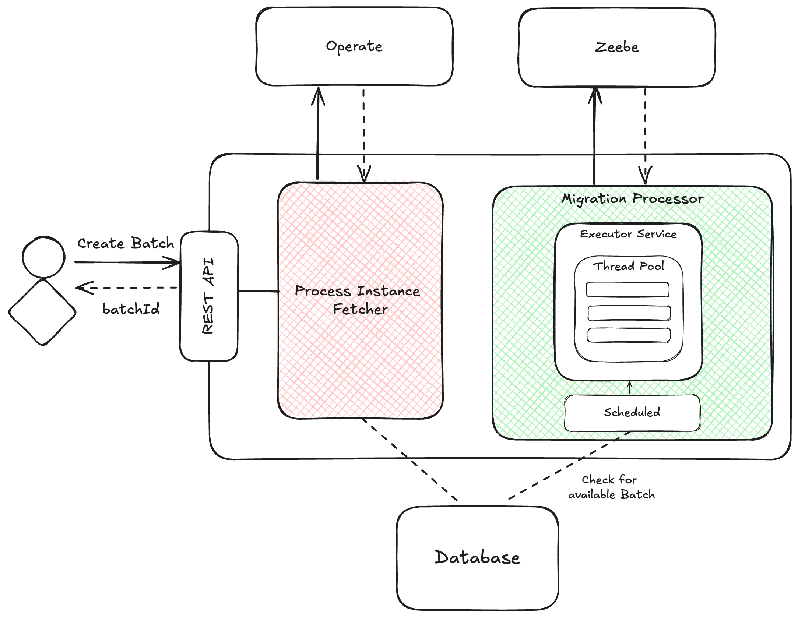

# Process Instance Migration Application

This project is a Spring Boot application designed for migrating process instances within a Camunda 8 Environment. It
provides tools for configuring, processing, and handling process instance migrations in a structured way.

## Read Before Use

**Important**: This project is currently under development and has not been extensively tested at a large scale. Please
exercise caution when using it in production environments.

While both Camunda Operate and the Zeebe API offer robust capabilities for migrating process instances to newer
versions, this tool is specifically designed for migrating **large batches** of instances. Before relying on this tool
for regular migrations of thousands of instances, consider the design of your application and whether frequent
large-scale migrations are necessary.

### Key Considerations:

- **Long-running Processes**: It's generally advisable not to have extremely long-running processes. Migrating state
  between versions of a process can be challenging, especially when newer versions introduce new variables that aren't
  present in already-running instances.

- **Backward Compatibility Issues**: When migrating, there might be steps added in newer versions that are not present
  in the currently active instance, which could lead to issues in referencing the correct status of the process.

- **Design Recommendations**:

    - **Decouple Parts of Processes**: Consider decoupling certain parts of your business processes into separate
      process definitions to minimize the scope of each process.
    - **Use Call Activities**: When designing your processes, use call activities with the binding set to **"latest"**
      to dynamically bind to the most recent process version, reducing the need for explicit migration.

## Architecture Overview



### Process Instance Fetcher

This component is responsible for fetching the process instances that need to be migrated. It uses the Operate REST API
to fetch the process instances based on the provided filters.

### Migration Processor

Once the instances are fetched, the Migration Processor handles the core migration logic. It ensures that each instance
is migrated to the target version according to the defined instructions. This separation allows for better preparation
and handling of large batches.

To prevent retry attempts from happening too quickly and potentially overwhelming the system, the MigrationProcessor
applies a backoff strategy. The backoff is applied with a random delay to ensure that retries are distributed over time
and reduce the risk of overloading the system.

### Batch Lifecycle

The application processes instances in **batches**, allowing for more efficient and scalable handling of migrations.
Each batch goes through several stages during its lifecycle:

1. **Batch Creation**: When a batch is created, it is initialized with a status of `READY`. At this point, the batch is
   set up with instructions for which process instances to migrate and any specific parameters for the migration. A flag
   `createPaused` can be set during creation if you want the batch to start in a paused state.

2. **Batch Processing**: Once the batch is in the `READY` state, the `MigrationProcessor` begins migrating the
   instances. The batch status is updated as it progresses.

3. **Pausing a Batch**: At any point during processing, a batch can be **paused**. This functionality allows you to
   temporarily halt the migration of instances within the batch. When a batch is paused, no further instances will be
   processed until it is explicitly resumed. This is useful when you need to intervene, investigate, or adjust the
   process without losing the batch’s state.

4. **Resuming a Batch**: After pausing, the batch can be resumed. The application will continue processing instances
   from where it left off.

5. **Batch Completion**: When all instances within the batch have been successfully migrated, the batch status is
   updated to `COMPLETED`.

6. **Batch Failure**: If a batch encounters an error during processing that prevents further migration, the batch is
   marked as `FAILED`. This allows you to investigate the issue and retry or resolve it manually.

### Lifecycle Statuses:

- **READY**: The batch is ready to start processing.
- **PROCESSING**: The batch is currently being processed.
- **PAUSED**: The batch is paused and awaiting resumption.
- **COMPLETED**: The batch has finished processing all instances.
- **FAILED**: The batch encountered an error during processing.

## Limitations

- **Process Instance Migration Limitations**:
  Current [Product Limitations](https://docs.camunda.io/docs/components/concepts/process-instance-migration/) also apply
  to this application.
- **Variables**: The application currently only supports migrating variables that are defined at the global scope.
  Variables defined within local scopes (e.g., within a subprocess) are not supported.
- **One Batch at a Time:** Only one batch can be processed at a time. However, within the batch, multiple instances can
  be processed concurrently.

## Configuration

### Migration Processor

The Migration Processor can be configured with the following properties in the application.yaml:

```
process-instance-migration:
  enabled: true # Can be disabled to prevent processing of new batches
  thread-pool-size: 5 # Number of threads to use for processing instances
  backoff-minimum: 1000 # Minimum backoff time in milliseconds
  backoff-maximum: 40000 # Maximum backoff time in milliseconds
  retry-limit: 5 # Maximum number of retries for a failed instance
```

### Specifics

#### Operate Client

Please refer to
the [Operate Spring Boot Starter](https://github.com/camunda-community-hub/camunda-operate-client-java/tree/main)
documentation for configuration options.

#### Zeebe Client

Please refer to the [Zeebe SDK Documentation](https://docs.camunda.io/docs/apis-tools/spring-zeebe-sdk/configuration/)
for configuration options.

## OpenAPI Specification

The OpenAPI spec is available at the following URL when the application is running: ``/swagger-ui/index.html`` or
``/v3/api-docs``

## Docker Image

### Step 1: Build the Spring Boot Application JAR

First, ensure that you have built your Spring Boot application by running the following command in the root of your
Spring Boot project directory:

```bash
mvn clean package
```

This will generate a `.jar` file in the `target` directory of your project.

### Step 2: Build the Docker Image

Run the following command to build the Docker image. Be sure to run this command in the same directory as the
`Dockerfile`:

```bash
docker build -t process-instance-migration .
```

### Step 3: Run the Docker Container

Once the image is built, you can run the Docker container with the following command:

```bash
docker run -p 8080:8080 process-instance-migration
```

This will start the Spring Boot application inside a Docker container and map port `8080` on your local machine to port
`8080` inside the container.

## TODOs

- [ ] Unit Tests
- [ ] Integration Tests
- [ ] Performance Testing / Importer Lag